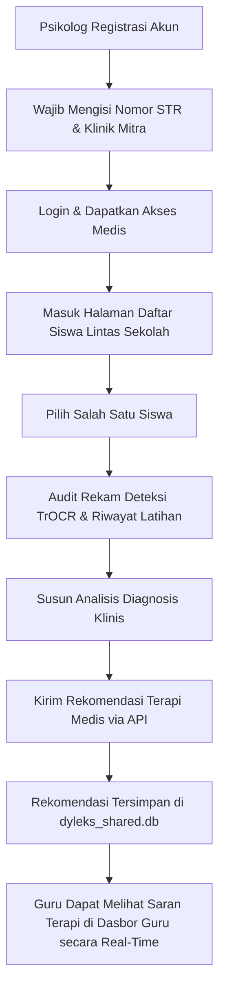

# 🩺 Portal Psikolog - DyLeks (DYLEKS-PSIKOLOG)

Portal Psikolog adalah modul klinis dan medis profesional yang disediakan khusus bagi Psikolog atau terapis bersertifikat untuk memantau rekam data kesalahan tulis motorik anak disleksia lintas sekolah, menegakkan diagnosis, dan menuliskan intervensi rujukan medis langsung.

---

## 🧭 Diagram Alur Kerja Psikolog (Clinical Audit Workflow)

Berikut adalah diagram alur bagaimana seorang psikolog mengakses data siswa secara terpusat dan memberikan rekomendasi terapi klinis:



---

## 🛡️ Fitur Utama Portal Psikolog

1.  **Validasi STR (Surat Tanda Registrasi):**
    *   Proses registrasi mewajibkan input nomor STR psikolog yang aktif dan nama klinik mitra guna menjamin validitas rujukan medis yang diberikan.
2.  **Pemantauan Siswa Terpusat (Cross-School Monitoring):**
    *   Psikolog dapat melihat daftar seluruh siswa di bawah naungan berbagai guru di wilayah kerja luring tersebut untuk melakukan pengawasan terpusat.
3.  **Audit Riwayat Kesalahan Tulisan Tangan:**
    *   Tinjauan rinci terhadap hasil deteksi coretan motorik (kinestetik) siswa beserta tangkapan umpan balik (feedback) TrOCR AI luring.
4.  **Rekomendasi Klinis & Terapi:**
    *   Formulir khusus untuk mengirimkan rujukan catatan klinis resmi yang akan langsung tampil pada dasbor guru bersangkutan.
5.  **Self-Healing Database Migrations:**
    *   Sistem migrasi otomatis pada startup backend untuk menyisipkan kolom data baru seperti `last_seen` secara dinamis pada database SQLite bersama (`dyleks_shared.db`) luring tanpa risiko merusak integritas data klinis yang sudah ada.

---

## ⚙️ Panduan Menjalankan Layanan Lokal

Portal Psikolog terdiri dari komponen Frontend dan Backend. Untuk menjalankannya secara lokal:

### 1. Backend (Psikolog BE)
*   **Port Default:** `3008`
*   **Prasyarat:** Python 3.12, menginstal `requirements.txt`.
*   **Cara Menjalankan:**
    ```bash
    cd BE
    pip install -r requirements.txt
    python -m uvicorn app.main:app --host 0.0.0.0 --port 3008
    ```

### 2. Frontend (Psikolog FE)
*   **Port Default:** `3007`
*   **Prasyarat:** Node.js 18+.
*   **Cara Menjalankan:**
    ```bash
    cd FE
    npm install
    npm run dev -- -p 3007
    ```
