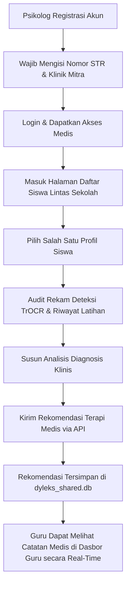

# 🩺 Portal Psikolog - DyLeks (DYLEKS-PSIKOLOG)

Portal Psikolog adalah modul klinis dan medis profesional yang dikhususkan bagi Psikolog anak atau terapis wicara bersertifikat untuk memantau rekam data tulisan tangan motorik anak disleksia lintas sekolah, menegakkan diagnosis formal, dan menuliskan intervensi rujukan medis langsung.

Modul ini terhubung secara langsung ke basis data bersama lokal (`shared_db/dyleks_shared.db`), memungkinkan hasil skrining diunggah oleh guru langsung dapat di-audit secara klinis oleh psikolog.

---

## 🧭 Diagram Alur Kerja Psikolog (Clinical Audit Workflow)



---

## 📁 Struktur Direktori Portal Psikolog

```
Psikolog/
├── BE/                           # Backend Server (FastAPI)
│   ├── app/
│   │   ├── api/v1/               # Router Endpoints (auth_service, psychologist_service, dll.)
│   │   ├── core/                 # Konfigurasi Database & Security
│   │   ├── models/               # Model ORM (psychologist.py, child_profile.py, dll.)
│   │   ├── schemas/              # Pydantic Schemas
│   │   ├── services/             # Logika Bisnis & Validasi STR
│   │   ├── config.py             # Pengaturan Variabel Lingkungan
│   │   └── main.py               # Entrypoint Utama Backend & Auto-Migration
│   ├── tests/                    # Unit Test Backend
│   ├── Dockerfile                # Deployment Container
│   ├── requirements.txt          # Dependensi Python
│   └── wsgi.py                   # Runner WSGI
│
└── FE/                           # Frontend Client (Next.js Dashboard)
    ├── components/               # Komponen UI Khusus Medis
    ├── contexts/                 # Context API
    ├── pages/                    # Halaman Next.js (index.tsx, login, register, audit/)
    ├── public/                   # Aset Statis
    ├── styles/                   # File CSS Vanilla
    └── package.json              # Dependensi Node.js
```

---

## 🛠️ Cara Kerja Sistem (Deep-Dive Technical Mechanics)

### 1. Registrasi & Validasi STR (Surat Tanda Registrasi)
*   **Keamanan Data Medis:** Karena portal ini berurusan dengan data diagnosis klinis sensitif anak, registrasi akun psikolog mewajibkan pengisian Nomor STR (Surat Tanda Registrasi) medis yang aktif serta Klinik/Instansi Mitra.
*   **Penyimpanan Kredensial:** Data STR disimpan secara terenkripsi di tabel `psychologists`. Hanya akun dengan data STR terverifikasi yang diberikan token otorisasi JWT bertipe khusus untuk melakukan penulisan catatan klinis pada tabel rekomendasi.

### 2. Audit Riwayat Kesalahan Motorik & Citra TrOCR
*   Psikolog masuk ke dasbor dan disajikan tabel daftar seluruh anak lintas sekolah di bawah naungan berbagai guru.
*   **Tinjauan Citra Coretan:** Psikolog dapat membuka tangkapan gambar pengerjaan motorik anak. Gambar ini ditarik secara lokal dalam format Base64 dari log pengerjaan yang tersimpan di database.
*   **Grafik Pola Kesalahan:** Sistem me-render persentase kesalahan fonologis, inversi visual, dan omisi kata yang dihitung secara dinamis dari tabel `learning_sessions` untuk mempermudah psikolog dalam menganalisis keparahan disleksia anak.

### 3. Pipeline Rujukan & Catatan Rekomendasi Terapi Medis
*   Setelah meninjau riwayat kesalahan tulisan anak, psikolog dapat mengisi formulir rujukan terapi klinis.
*   **Penyimpanan Relasional:** Saat dikirim, data disimpan ke tabel `psychologist_recommendations` yang terhubung secara relasional ke `child_profiles` (menggunakan kunci asing `child_id`) dan `psychologists` (menggunakan kunci asing `psychologist_id`).
*   **Integrasi ke Dasbor Guru:** Karena database bersifat berbagi (*shared database*), rekomendasi terapi yang disimpan psikolog langsung terbaca secara real-time pada saat Guru membuka halaman detail siswa tersebut di dasbornya.

### 4. Self-Healing Database & WAL Mode Lintas Portal
*   Backend Psikolog BE membagikan file database SQLite yang sama dengan backend Guru BE dan Siswa BE di path `shared_db/dyleks_shared.db`.
*   Untuk menjamin kelancaran penulisan data rujukan medis secara simultan, database dikonfigurasi dalam mode **Write-Ahead Logging (WAL)**.
*   Ketika startup, [main.py](file:///d:/4. Thoriq_KULIAH/1.Lomba Thoriq/SEMESTER 4/05. Samsung/DyLeks/Psikolog/BE/app/main.py) mendeteksi dan secara otomatis menambahkan kolom skema database baru (seperti `last_seen`) agar sinkron dengan model yang dimiliki Siswa BE, tanpa merusak atau menghilangkan data catatan medis yang telah ditulis oleh psikolog sebelumnya.

---

## ⚙️ Cara Menjalankan Layanan Secara Manual

### 1. Jalankan Backend (Psikolog BE)
*   **Port Default:** `3008`
*   **Langkah-langkah:**
    ```powershell
    cd BE
    # Membuat Virtual Environment
    python -m venv venv
    venv\Scripts\activate
    # Menginstal dependensi
    pip install -r requirements.txt
    # Menjalankan server
    python -m uvicorn app.main:app --host 0.0.0.0 --port 3008 --reload
    ```

### 2. Jalankan Frontend (Psikolog FE)
*   **Port Default:** `3007`
*   **Langkah-langkah:**
    ```powershell
    cd FE
    # Menginstal dependensi Node
    npm install
    # Menjalankan Next.js development server di port 3007
    npm run dev -- -p 3007
    ```
